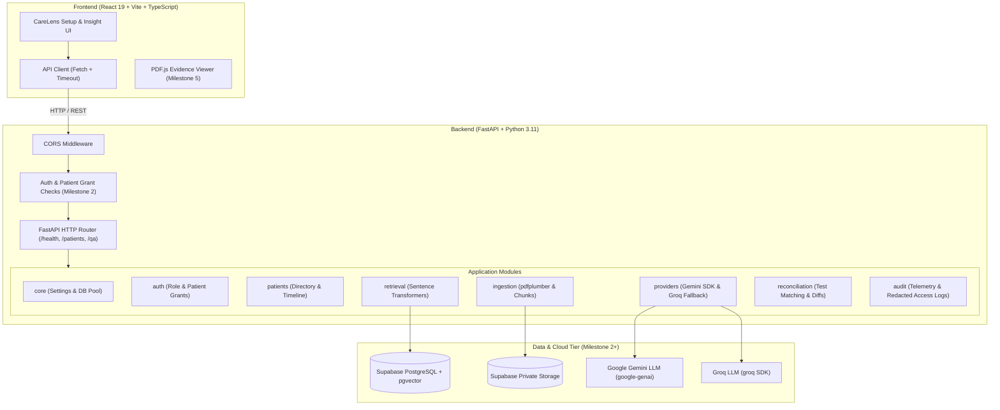

# CareLens AI Architecture Specification

CareLens AI is a clinical insight engine built for authorized clinic staff to explore and analyze synthetic patient electronic health records (EHR).

## High-Level System Architecture

## Module Boundaries & Descriptions

| Module | Responsibility Boundary | Milestone |
| :--- | :--- | :--- |
| `core` | Environment settings management (`pydantic-settings`) and database connection pooling. | M1 (Foundations) |
| `auth` | JWT token validation, clinic staff role verification, and patient-level access grants. | M2 |
| `api` | FastAPI route endpoints and request validation. Authorization occurs before any service execution. | M1 + M2 |
| `schemas` | Single source of truth for shared Pydantic data contracts and TypeScript interfaces. | M1 |
| `patients` | Patient directory lookups, timeline compilation, and dynamic patient case brief construction. | M2 & M5 |
| `documents` | Private storage file uploads, signed URL generation, and ingestion state orchestration. | M3 |
| `ingestion` | PDF page extraction (`pdfplumber`), text chunking, bounding box provenance, and candidate facts. | M3 |
| `retrieval` | Patient-scoped vector search using local Sentence Transformers (`all-MiniLM-L6-v2`) and `pgvector`. | M4 |
| `providers` | LLM completion adapter wrapping primary Gemini (`google-genai`) and fallback Groq (`groq`). | M4 & M7 |
| `reconciliation`| Test/result matching, treatment cycle comparison, and versioned report delta tracking. | M6 |
| `audit` | Access and query telemetry logging without exposing credentials or PHI secrets. | M2+ |
